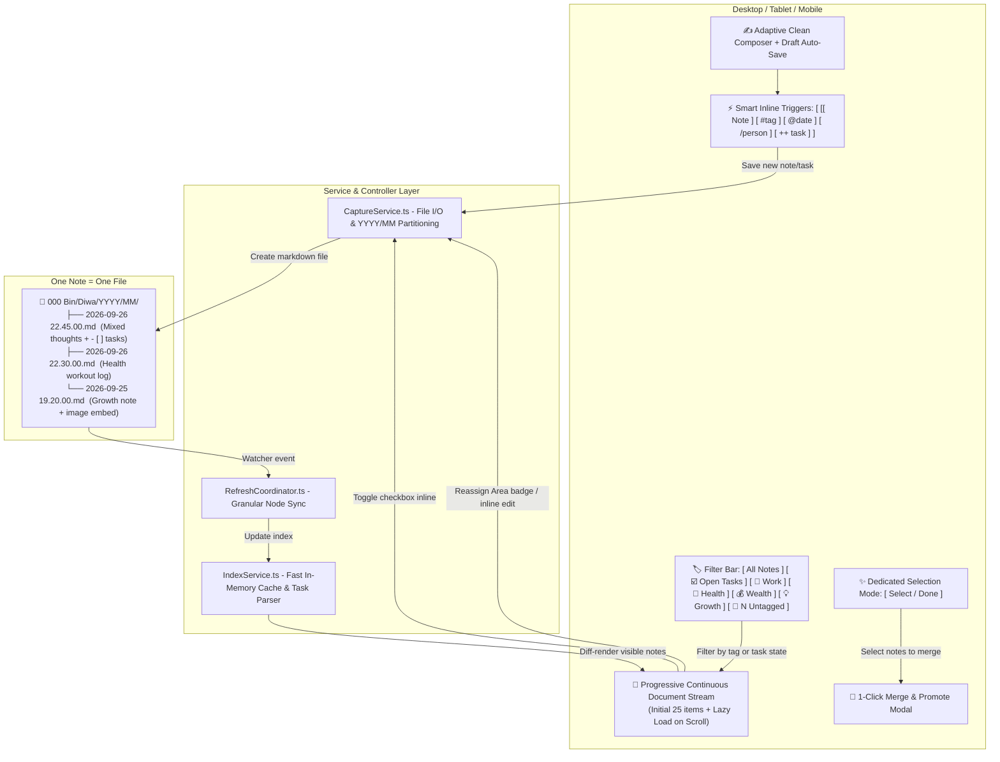
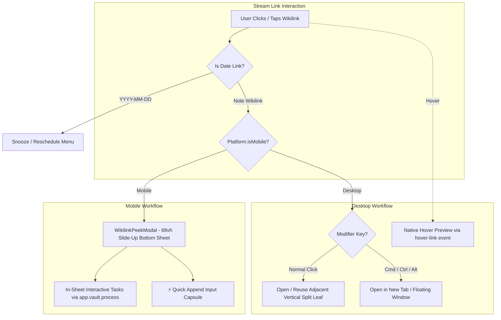

# DIWA Continuous Scratchpad — Master System Design Document

## 1. Executive Summary
**DIWA** (Personal OS) is an Obsidian plugin designed for zero-friction note capture across all areas of life, pairing instantaneous input with structured, portable data storage.

* **Core Interaction Principle**: *"Open $\rightarrow$ Type $\rightarrow$ Done."*
* **Visual Paradigm**: **Continuous Document Stream** — A typography-first, flowing document without card borders, inner outline noise, or clutter.
* **Storage Model**: **One Note = One File (Atomic Notes)** with automated Year/Month partitioning (`000 Bin/Diwa/YYYY/MM/YYYY-MM-DD HH.mm.ss.md`).
* **Multi-Device Adaptivity**: Full top Hero Composer with keyboard shortcuts (`⌘ Enter`) on Desktop and Tablet; compact 2-row frosted-glass floating composer on Mobile.
* **Integrated Task Management**: Markdown `- [ ]` tasks with in-place live checkbox toggling, optimistic strike-through feedback, and a 1-tap `[ ☑️ Open Tasks ]` filter.
* **Dynamic Note Taxonomy**: Reassign life area tags anytime via 1-tap badge menus or inline editor area selector chips.
* **Smart Autocomplete Engine**: Native support for inline triggers (`[[`, `#`, `@`, `/`, `++`) and direct clipboard image pasting.

---

## 2. Architecture & Data Flow



---

## 3. Vault Data Schema & Storage

### 3.1 Directory Organization
Files are stored automatically in Year/Month partitioned directories to ensure cloud sync stability and avoid flat-folder clutter:
`<CaptureFolder>/<YYYY>/<MM>/YYYY-MM-DD HH.mm.ss.md`

Default root path: `000 Bin/Diwa/`
Example: `000 Bin/Diwa/2026/09/2026-09-26 22.45.00.md`

### 3.2 File Frontmatter & Content Contract
```markdown
---
created: 2026-09-26T22:45:00
modified: 2026-09-26T22:45:00
area: work
tags:
  - work
hasTasks: true
---
Q4 Sprint Kickoff with Sarah:
Discussed priority deliverables for the marketing campaign.

- [ ] Finalize copy draft by Tuesday #work
- [x] Send analytics dashboard to engineering team #work

![[campaign_wireframe.png]]
```

---

## 4. UI Layout Specifications

### 4.1 Desktop & Tablet Layout
* **Header Bar**: Plugin title, quick search input, `[ Select ]` multi-note merge toggle, `[ 🧹 N Untagged ]` Inbox Sweeper button, Settings button.
* **Top Hero Composer**: Auto-expanding textarea, clean borderless input styling, life area chips (`[💼 Work]` `[🌱 Health]` `[💰 Wealth]` `[💡 Growth]`), `[ ☑️ Task ]` shortcut, shortcut hint (`⌘ Enter`), and `Capture Note` button.
* **Continuous Stream**: Full-width document typography with hairline date dividers, timestamps, interactive area badges, inline embeds, and action menu (`Edit ✏️`, `Delete 🗑️`).

### 4.2 Mobile Layout
* **Top Header**: Single-row compact bar (`DIWA` on left; 1-tap `[ 🔍 ]` expandable search, `[ 📱 ]` Obsidian nav bar toggle, `[ Select ]`, `[ ⚙️ ]` on right).
* **Filter Carousel**: Compact horizontal pills with live count badges (`All`, `Open Tasks`, `Today`, `Upcoming`, Life Areas).
* **Center Stream**: Touch-friendly reading stream with generous 140px bottom scroll clearance and 1.25x scaled checkboxes.
* **Edge-to-Edge Floating Composer**: Frosted-glass container (`backdrop-filter: blur(24px)`) with zero inner outline noise:
  * **Row 1 (Maximized Input)**: 100% full-width borderless auto-expanding input capsule + circular accent send button `[ ↑ ]`.
  * **Row 2 (Accessory Toolbar)**: `[ ☑️ Task ]` shortcut pill + horizontal swipeable Life Area pills (`[ 💼 Work ] [ 🌱 Health ] ...`).
* **Obsidian Mobile Navigation Bar Management**:
  * Auto-hides native `< > 🔍 + [1] ☰` bottom navbar while inside DIWA (`diwa-hide-mobile-navbar`).
  * 1-tap `[ 📱 ]` header toggle allows restoring or hiding the nav bar on demand.
  * Automatic safe-area offset (`env(safe-area-inset-bottom)`) so the composer never collides when the nav bar is visible.
* **Viewport Drift Protection & Touch Isolation**:
  * Root viewport locked with `overflow-x: hidden !important;`, `overscroll-behavior-x: none !important;`, and `touch-action: pan-y;`.
  * Horizontal scrolling isolated strictly to inner pill carousels (`touch-action: pan-x;`), preventing whole-page side swiping or horizontal bouncing.
* **Textarea Glyph Clearance & Inset**:
  * Dedicated `padding: 3px 6px` on the textarea with softened `14px` capsule curvature, ensuring tall initial characters (`A`, `H`, `W`) and text cursors never clip on mobile.


---

## 5. Smart Autocomplete Triggers

| Trigger | Engine / Modal | Behavior & Insertion |
| :--- | :--- | :--- |
| **`[[`** | `FileSuggestModal` | Opens note suggester $\rightarrow$ inserts `[[Note Title]] `. |
| **`#`** | `ContextSuggestModal` | Opens tag suggester listing Life Areas (`#work`, `#health`, `#wealth`, `#growth`) + existing tags $\rightarrow$ inserts `#tag `. |
| **`@`** | `chrono-node` Date Parser | Types `@tomorrow `, `@friday `, `@in 3 days ` $\rightarrow$ converts to `[[YYYY-MM-DD]] `. |
| **`/`** | `PersonSuggestModal` | Searches or creates profiles in `000 Bin/DIWA People/` $\rightarrow$ inserts `[[Person Name]] `. |
| **`++`** / **`+ `** | Instant Conversion | Typing `++` anywhere or `+ ` at line start transforms immediately into `- [ ] `. |
| **Media Paste** | `attachMediaPasteHandler` | Pasting image files from clipboard saves them to attachments folder and inserts `![[image.png]]`. |

---

## 6. Key Functional Modules

1. **Progressive Lazy-Loading**: Initial viewport renders 25 most recent notes. `IntersectionObserver` loads subsequent batches as the user scrolls, backed by an in-memory Markdown render cache.
2. **Draft Auto-Recovery**: Composer input is continuously saved to local storage, preventing text loss on app restart or unexpected focus changes.
3. **Interactive Checkboxes**: Markdown checkboxes (`- [ ]` $\leftrightarrow$ `- [x]`) toggle live in the document stream with optimistic visual strike-through and instant background file modification.
4. **Dedicated Multi-Select Mode**: Clean stream by default. Tapping `Select` exposes selection checkboxes and the `🔀 Merge Selected` bar for bulk consolidation.
5. **Note Taxonomy Editing**:
   * **Direct Dropdown Menu**: Click any note's area badge (or `+ Area`) to immediately reassign or clear its life area taxonomy.
   * **Inline Editor Chips**: Edit note body and area categorization simultaneously via `✏️ Edit`.
6. **Inbox Sweeper**: 1-click filter for untagged notes, allowing rapid categorization.
7. **Instant Search & Filter**: Real-time debounced keyword search, tag filters, and task filters with zero UI latency.
8. **Date Reminders & Future Resurfacing (Digital Tickler File)**:
   * **`📅 Today` Filter Pill**: Real-time counter badge and stream filter showing notes/tasks scheduled with `[[YYYY-MM-DD]]` matching today.
   * **`📆 Upcoming` Filter Pill**: Real-time counter badge and stream filter showing all future-scheduled notes/tasks (`[[YYYY-MM-DD]] > today`).
   * **Forward Chronological Horizon Sorting**: When in Upcoming mode, notes are automatically sorted chronologically from soonest to furthest ($T+1 \rightarrow T+2 \dots$) under clean horizon dividers (`Tomorrow · <Day>`, `This Week · <Day>`, `Next Week · <Day>`, `<Month> <D>, <YYYY>`).
   * **Color-Coded Badges**: `📅 Today` (amber accent), `⏳ Past` (muted temporal note reminder), `📆 Future` (calm blue).
   * **1-Tap Interactive Snooze Menu**:
     * ⏰ **Snooze to Tomorrow (+1 Day)**: Atomically modifies `[[YYYY-MM-DD]]` in note file to tomorrow.
     * 📅 **Snooze +3 Days**
     * 🗓️ **Snooze +1 Week**
     * 📌 **Pick Custom Date...**: Opens `DatePickerModal` with quick date shortcuts.
     * ✕ **Clear Reminder Date**: Cleans up date link without deleting text.
     * 📖 **Open Daily Note**: Direct navigation to date note.
   * **Interactive Rendered Links**: Internal links matching dates inside note text allow 1-tap snoozing directly from the body.

---

## 7. Mobile Search & Viewport Architecture

### 7.1 Visual Viewport & Keyboard Height Management
* **`attachMobileSheetViewportBehavior`**: On mobile, `DesktopHubView` attaches a visual viewport observer (`window.visualViewport`) on `onOpen()` and tears it down on `onClose()`.
* **Keyboard Class**: Detects keyboard appearance at a 72px threshold from the visual viewport or Obsidian's `--keyboard-height` and toggles `.has-mobile-keyboard` on the root for compact styling. On the affected iPhone, `visualViewport` stayed at full height while Obsidian reported `--keyboard-height: 301px`. `--diwa-kb-h` remains available for uncompensated overlap in mobile sheets.
* **Obsidian Owns Keyboard Height**: Obsidian mobile shrinks its workspace above the keyboard. DIWA keeps `.diwa-workspace-root` at `height: 100%` of that space; do not impose a keyboard-specific root height or `100dvh`.
* **Single Vertical Scroller When Keyboard Is Open**: The workspace root scrolls, not the inner `.pos-scratchpad-container`. Its normal mobile `overflow-x: hidden !important` implicitly makes `overflow-y` scrollable; therefore the keyboard-open selector must override it with `overflow: visible !important` (a non-important override does not win the cascade). The keyboard-open container uses `flex: 0 0 auto; min-height: 100%`, and `.pos-document-stream` uses `flex: 0 0 auto; min-height: auto`, preserving the header and stream instead of shrinking them away. This override is scoped to keyboard-open mobile layout; other layouts retain their existing horizontal overflow protection.

### 7.2 Mobile Search Experience & Stream Precedence
* **Global Search Scope**: When a query is present in `_searchQuery`, `getFilteredCaptures()` prioritizes the keyword search across all notes in the vault, ignoring restrictive category or status filters.
* **Stream Refresh on Search Trigger**: Tapping the `[ 🔍 ]` search toggle automatically sets active filter to `'all'` and triggers immediate stream re-rendering.
* **Distraction-Free Search Mode**:
  * Floating composer automatically hidden (`.pos-mobile-sticky-composer.is-hidden`).
  * Filter carousel bar hidden (`.pos-filter-bar.is-hidden`).
  * Reduced container padding and gap (`padding-top: 6px !important; gap: 6px !important;`).
  * Instant feedback banner (`🔍 Found N notes matching "<query>"`) and compact top-aligned empty state (`🔍 No notes matching "<query>"`).

### 7.3 On-Device Diagnosis and Resolution
* With the keyboard open, diagnostics measured a correctly sized root (`440px`) but a `127px` scratchpad container and a `0px` document stream; the exposed root background appeared as a black band above the keyboard. Hit testing found no overlay in that band. A forced repaint did not help.
* The first scroll-ownership change was ineffective because `overflow-x: hidden !important` still won over `overflow: visible` in the mobile rule. Adding `!important` to the more specific keyboard-open `overflow: visible` rule fixed the reported issue on the user's iPhone. The temporary diagnostic strip and repaint workaround were removed.

---

## 8. Wikilink System Interaction Architecture

### 8.1 The Leaf Protection Principle
In standard Obsidian, clicking an internal link (`<a class="internal-link">`) inside a custom leaf (`ItemView`) replaces the active view with the linked note unless explicitly handled. Within the DIWA Continuous Workspace, this destroys capture momentum: the stream position is lost, active filters reset, and the user must navigate backward to resume triage.

DIWA implements a **dual-platform, context-preserving interaction system** that segregates temporal date links from note wikilinks, guaranteeing that the DIWA workspace leaf is never unintentionally evicted.



### 8.2 Mobile: Slide-Up Peek Sheet (`WikilinkPeekModal`)
1. **Ergonomic Sheet Presentation**:
   - Slides up from the bottom to **68vh** (expanding to 88vh), resting firmly inside the thumb-reach zone.
   - Backdrop blur (`backdrop-filter: blur(8px)`) over the DIWA stream maintains spatial context without distraction.
   - **Swipe-Down Dismissal**: Touch drag-handle at the top tracks touch delta. Pulling down past 80px triggers an animated dismissal back to the exact scroll position in the stream.
2. **Live In-Sheet Markdown & Task Toggling**:
   - Renders the target note’s markdown body in real time using `MarkdownRenderer` bound to an isolated `Component` lifecycle.
   - Interactive checkboxes inside the referenced note can be checked off in-place (`- [ ]` $\leftrightarrow$ `- [x]`), committing changes directly to the file via atomic `app.vault.process()` transactions.
3. **⚡ Quick Append Bar**:
   - Sticky footer input capsule allows capturing a rapid thought, meeting note, or `- [ ]` task directly into the referenced note without opening the file.
4. **Unresolved / Ghost Link Handling**:
   - When referencing a note that has not yet been created, the sheet displays a clean "Note does not exist yet" card with a 1-tap **`[ ➕ Create Note ]`** action.

### 8.3 Desktop: Protected Split Navigation
1. **Leaf Safeguarding**:
   - Standard left-click searches for an open adjacent markdown leaf (`workspace.getLeavesOfType('markdown')`). If found, it opens the target note there. If none exists, it opens a vertical split pane (`split: 'vertical'`). The DIWA leaf remains completely open on the left.
2. **Native Modifier Clicks**:
   - `Cmd / Ctrl + Click`: Opens the note in a new background tab (`'tab'`).
   - `Alt + Click`: Opens the note in a separate floating popout window (`'window'`).
3. **Native Hover Preview**:
   - Listens to mouseover events and fires Obsidian's `hover-link` event, allowing the native core **Page Preview** popover to activate seamlessly.

### 8.4 Stream Pivot Filtering (`filterStreamByWikilink`)
- **Right-Click (Desktop) & Long-Press (Mobile)**: Opens an action context menu containing:
  - 👁️ *Quick Preview*
  - 🔍 *Filter Stream for `[[Note]]`*
  - 📖 *Open in Adjacent Split*
  - 🗂️ *Open in New Tab*
  - 📋 *Copy Wikilink*
- **Search Pivot**: Triggering *Filter Stream* (or the search icon in the sheet header) pivots the DIWA search input to that entity name, immediately collapsing the continuous scratchpad to display all related inbox captures.
