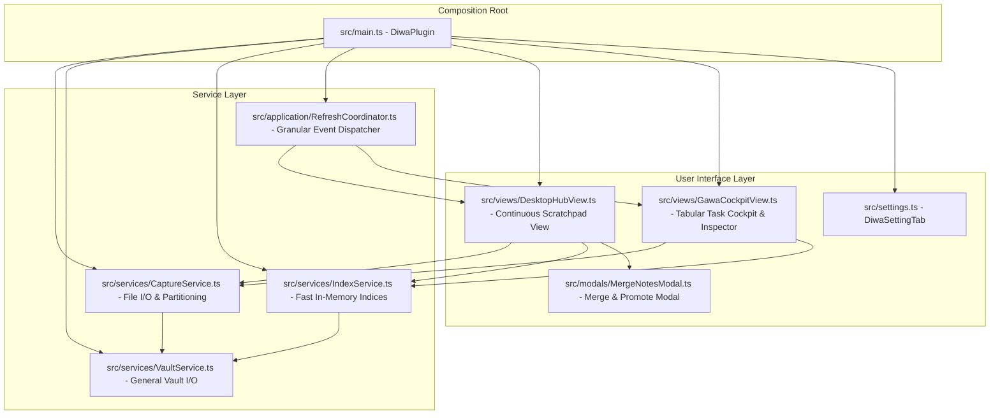

# System Patterns: DIWA — Personal OS Architecture

## 1. Tech Stack & Dependencies
*   **Compilation**: Compiled via `esbuild.config.mjs` from `src/main.ts` into a single file `main.js`, with style declarations in `styles.css`. Builds are deployed automatically to the active vault at `/Users/K26/Obsidian/K0000/.obsidian/plugins/Obsidian_diwa`.
*   **TypeScript**: Targeted at `ESNext` modules with strict type checks.
*   **Dependencies**: Obsidian API, `chrono-node` for natural-language dates.

---

## 2. Core Service Architecture

DIWA uses a decoupled, event-driven service architecture:

### Capture Service (`src/services/CaptureService.ts`)
*   Manages atomic note creation in `<captureFolder>/YYYY/MM/YYYY-MM-DD HH.mm.ss.md` (default: `000 Bin/Diwa/`).
*   Generates clean YAML frontmatter (`created`, `modified`, `area`, `tags`, `hasTasks`).
*   Provides in-place task toggling (`toggleTaskInFile`), updating markdown `- [ ]` $\leftrightarrow$ `- [x]` without UI reload.
*   Provides atomic note content and taxonomy updates (`updateNoteContent`).
*   Draft persistence in `localStorage` for zero-data-loss user input.
*   Multi-note merging (`mergeNotes`).

### Index Service (`src/services/IndexService.ts`)
*   Synchronous in-memory cache: `captureIndex: Map<string, CaptureEntry>`.
*   Parses frontmatter, body, markdown tasks, and tags.
*   Provides instant queries: `getAllCaptures()`, `getOpenTaskCount()`, `getUntaggedCount()`, `getAreaCounts()`.

### Refresh Coordinator (`src/application/RefreshCoordinator.ts`)
*   Listens to Obsidian workspace and vault events with debouncing and cooldown mechanisms to avoid duplicate re-renders.
*   Dispatches granular refresh events (`all`, `tasks`, `thoughts`, `capture`) to open views.

---

## 3. Continuous Scratchpad View (`DesktopHubView`)

The **Continuous Scratchpad** is the primary interactive hub:
1.  **Header Bar**: Logo, fast debounced search input, `[ Select ]` multi-note merge toggle, `[ 🧹 N Untagged ]` Inbox Sweeper button, Settings button.
2.  **Filter Carousel**: `[ All Notes ]`, `[ ☑️ Open Tasks ]`, Life Area chips (`[ 💼 Work ]`, `[ 🌱 Health ]`, `[ 💰 Wealth ]`, `[ 💡 Growth ]`).
3.  **Adaptive Composer**:
    *   *Desktop & Tablet*: Top Hero composer with borderless input capsule, `[ ☑️ Task ]` shortcut, life area selector chips, and `⌘ Enter` save shortcut.
    *   *Mobile*: Compact 2-row frosted-glass floating bar (`backdrop-filter: blur(20px)`) with zero inner outline noise: Row 1 task shortcut + input + circular send button; Row 2 swipeable life-area pills.
4.  **Continuous Document Stream**:
    *   Clean typography without card boxes, borders, or inner outlines.
    *   Hairline date separator dividers ("Today", "Yesterday", etc.).
    *   Interactive life area badges with 1-tap dropdown menu for direct category reassignment.
    *   Rendered markdown body with embeds and inline interactive `- [ ]` checkboxes with strike-through feedback.
    *   Action menu: Edit in-place (`✏️`), Delete (`🗑️`), and dedicated `Select` mode for multi-note merge.
5.  **Performance Optimization**: Progressive 25-item lazy loading via `IntersectionObserver` with in-memory Markdown DOM cache.

---

## 4. Mobile Viewport & Search Architecture
*   **Visual Viewport Listener**: `attachMobileSheetViewportBehavior` tracks `window.visualViewport` to compute `--diwa-kb-h` as the uncompensated keyboard overlap (used by mobile modal sheets) and toggle `.has-mobile-keyboard` on `DesktopHubView.contentEl` for compact styling.
*   **No Root Resizing on Keyboard**: Obsidian mobile already sizes its container with its own `--keyboard-height`. `.diwa-workspace-root` must stay `height: 100%` — no keyboard-open height override and no `100dvh` — otherwise the view is shrunk twice and a black gap appears above the keyboard.
*   **Root-Only Scroll Ownership**: Keyboard-open mobile styles keep `.diwa-workspace-root` as the only vertical scroller. The scratchpad container uses content-sized flex layout and `overflow: visible !important` to override its mobile `overflow-x: hidden !important`; without equal priority, it becomes an implicit vertical scroller and the document stream collapses to zero. The stream also uses nonshrinking flex sizing while the keyboard is open.
*   **Search Stream Precedence**: Keyword search in `getFilteredCaptures()` takes global precedence across all notes, bypassing category/life-area filters. Opening mobile search auto-resets filter to `'all'` and triggers immediate re-render.

---

## 5. Wikilink Interaction Architecture (`WikilinkPeekModal` & Protected Leaves)
*   **Link Routing & Segregation**: `DesktopHubView.attachInteractiveElements` intercepts all `a.internal-link` anchors in rendered stream captures:
    *   *Date Links* (`YYYY-MM-DD`): Intercepted by `openDateActionMenu` for snooze/tickler scheduling.
    *   *Note Wikilinks*: Handled through responsive platform routing without evicting the DIWA workspace leaf.
*   **Mobile Slide-Up Bottom Sheet (`WikilinkPeekModal`)**:
    *   Styled with `.pos-mobile-bottom-sheet` and `.pos-bottom-sheet-backdrop` (`backdrop-filter: blur(8px)`).
    *   Occupies 68vh (expanding up to 88vh) with touch drag-handle and swipe-down-to-dismiss gesture threshold (>80px delta).
    *   Renders note markdown live via `MarkdownRenderer` with explicit `Component` lifecycle (`load()`/`unload()`).
    *   Interactive task checkboxes inside the sheet update the target note atomically via `app.vault.process()`.
    *   Built-in **Quick Append Bar**: Allows appending thoughts or `- [ ]` tasks directly to the referenced note via atomic write without opening the note editor.
    *   Unresolved (Ghost) link handling: Displays clean empty state with a 1-tap `[ ➕ Create Note ]` action.
*   **Desktop Protected Split Navigation**:
    *   Normal left-click searches for an adjacent open markdown leaf (`workspace.getLeavesOfType('markdown')`) or opens a vertical split leaf (`workspace.getLeaf('split', 'vertical')`). The DIWA leaf is never replaced or evicted.
    *   Modifier clicks: `Cmd/Ctrl + Click` opens in a new background tab (`'tab'`), `Alt + Click` opens in a floating window (`'window'`).
    *   Hover Preview: Fires `workspace.trigger('hover-link', ...)` so Obsidian core's **Page Preview** works natively.
    *   Context Menu (`openWikilinkActionMenu`): Right-click (or long press on mobile) provides instant options: *Quick Preview*, *Filter Stream for [[...]]*, *Open in Adjacent Split*, *Open in New Tab*, and *Copy Wikilink*.
*   **Stream Pivot Query (`filterStreamByWikilink`)**:
    *   Instantly targets DIWA search input to `[[Note]]` or note title, recalibrating the continuous stream and filter counters to display all related inbox captures.

---

## 6. Gawa Task Cockpit & Interoperability Architecture

### Autonomous Dedicated Leaf (`VIEW_TYPE_GAWA_COCKPIT`)
*   **Registration**: Registered alongside `VIEW_TYPE_DESKTOP_HUB` in `main.ts` with dedicated ribbon icon and command `DIWA: Open Gawa Task Cockpit`.
*   **Dual View Synergy**: Can be opened side-by-side in vertical split or docked in right sidebar without evicting the continuous scratchpad.
*   **Header Quick Launcher**: `DesktopHubView` header contains a 1-tap `[ 📋 Gawa (N) ]` launcher.

### In-Memory Task Model & Resolution (`GawaTaskRecord`)
*   **Earliest Due Date Resolution ("Earliest Date Wins")**: Scans `[[YYYY-MM-DD]]`, `📅 YYYY-MM-DD`, `[due:: YYYY-MM-DD]`, `@YYYY-MM-DD`, and raw ISO dates on task lines. Deduplicates and sorts ascending; earliest date becomes primary sortable `dueDate`.
*   **Life Area Resolution**: Detects inline area tags (`#work`, `#health`, etc.) or falls back to parent note frontmatter `area`.
*   **Indented Remarks & Notes**: Parses child indented lines beneath `- [ ]` tasks as structured remarks.

### Tabular Grid & Slide-Over Inspector
*   **Data Grid**: High-density sortable columns (`Status`, `Task Title`, `Due Date ↕`, `Life Area ↕`, `Remarks`, `Source ↗`).
*   **Horizon Filter Chips**: `[ All Open ]`, `[ 🔴 Overdue ]`, `[ 🟡 Today ]`, `[ 🟢 Upcoming ]`, `[ ⚪ Undated ]`.
*   **Slide-Over Inspector**:
    *   Desktop: 360px slide-in panel on row click.
    *   Mobile: Slide-up bottom sheet.
    *   Features: In-place title edit, quick date buttons (`Today`, `Tomorrow`, `+7d`, `Clear`), life area selector, live remarks textarea, and `CaptureService.updateTaskDetailsInFile` atomic persistence.

### Real-Time Bi-Directional Synchronization
*   Shared in-memory `IndexService` and event broker `RefreshCoordinator`.
*   Changes in `DesktopHubView` reflect in `GawaCockpitView` in 0ms without full page reloads.
*   Changes in `GawaCockpitView` reflect in `DesktopHubView` without scroll jumps.
*   Atomic file operations via `app.vault.process()` with content-matching fallback for line drift protection.

---

## 7. Calendar Digest & Review Architecture

### Master-Detail Dedicated Leaf (`VIEW_TYPE_CALENDAR_DIGEST`)
*   **Dual-Pane Structure**:
    *   *Left Rail (~280px)*: Month navigator, 7-column calendar grid with derived daily status dots (🟢 Digested, 🟡 Partial/Raw, ⚪ Empty), and quick horizon filters (`Today`, `Yesterday`).
    *   *Center Stage (Flex: 1)*: Date header, digest health pill, stream of note cards with rendered markdown, time, area badges, and primary `[ ⚡ Digest Day ]` action.
    *   *Mobile Adaptation*: Responsive segmented control `[ 📅 Calendar | 📝 Stream (N) ]` for narrow screens.
*   **Launchers**: Registered command `DIWA: Open Daily Digest & Review`, custom calendar icon (`CALENDAR_DIGEST_ICON_ID`), ribbon launcher, and 1-tap `[ 📅 Digest ]` header trigger in `DesktopHubView`.

### Block-Level Digestion Engine (`CaptureService.ts`)
*   **Structural AST Chunking (`parseDigestibleBlocks`)**: Treats tasks with all indented child subtasks and remarks, code fences, and paragraphs as indivisible `DigestibleBlock` records.
*   **Reverse-Chronological Top Insertion (`reconcileTargetNoteContent`)**:
    *   Injects open tasks at the top of `## Tasks` and logs/notes at the top of `## Log`.
    *   Strictly preserves YAML frontmatter and document `# Title` headers at the top of the file.
    *   Wraps injected content in deterministic guard comments (`<!-- diwa-digest:src=...:idx=... -->`) for 100% idempotent in-place updates during re-digests.
*   **Two-Phase Batch Mutations (`executeBatchDigest`)**: Compiles all target file operations in memory and executes exactly one `app.vault.process()` per target file, reducing disk I/O by >90% and eliminating race conditions.

### Gawa Project Task Synergy & Inbox Zero
*   **Cross-File Task Registry (`IndexService.ts`)**: Permanent notes containing digested tasks are tracked in `projectTaskIndex`. Tasks remain fully interactive in `GawaCockpitView.ts`, with `Source ↗` pointing directly to the project note.
*   **Scratchpad Inbox Zero**: Digested notes are hidden from the primary scratchpad feed by default, while remaining fully accessible in the Calendar Digest view on their respective dates.

---

## 8. Karon Today & Horizon Architecture (`VIEW_TYPE_KARON`)

### Autonomous Dedicated Leaf (`VIEW_TYPE_KARON = "diwa-karon"`)
*   **Registration**: Registered in `src/main.ts` with custom sunrise SVG icon (`KARON_ICON_ID`), dedicated ribbon launcher, and command `DIWA: Open Karon (Today & Horizon)`.
*   **Desktop Hub Integration**: 1-tap `[ ☀️ Karon ]` trigger in `DesktopHubView` header alongside `[ 📋 Gawa ]` and `[ 📅 Digest ]`.
*   **Reactive Event Coordination**: Subscribed to `RefreshCoordinator` so changes to tasks or notes reflect across all open views in 0ms.

### In-Memory Target Date Indexing (`IndexService.ts`)
*   **`targetDateIndex: Map<string, Set<string>>`**: Fast secondary index mapping each ISO date (`YYYY-MM-DD`) to files that reference that date:
    *   Explicit wikilinks in body: `[[YYYY-MM-DD]]`
    *   Frontmatter date properties: `due`, `scheduled`, `day`, `targetDate`
    *   Task-level due dates: `gawaTasks.dueDate`
*   **Snippet Extraction Engine (`extractTargetDateSnippets`)**: Extracts the exact paragraphs or blocks mentioning the target date for long notes, while rendering full notes when brief.

### Chronological Stream Layout (Option A)
*   **Horizon Switcher**: Dynamic selector (`[ ☀️ Today ]`, `[ 📅 3 Days ]`, `[ 🗓️ 7 Days ]`).
*   **Overdue Tasks Banner**: High-priority alert displaying overdue tasks with live checkboxes and relative overdue days (`1d overdue`, etc.).
*   **Collapsible Day Accordions**: Chronological sections from Today (`D+0`) to horizon end (`D+7`) with task and note summary pills.
*   **Task List**: Interactive checkboxes backed by `CaptureService.toggleTaskInFile`, area badges, and file peek links.
*   **Note Cards**: Rendered markdown snippets with `MarkdownRenderer` and internal link peek handling (`WikilinkPeekModal`).

## 9. Multi-Folder Task Indexing Architecture
*   **Dual-Scope Index Separation**:
    *   **Capture Inbox Scope**: The continuous scratchpad stream (`DesktopHubView`) and Daily Digest (`CalendarDigestView`) remain strictly scoped to `captureFolder` (`000 Bin/Diwa`).
    *   **Task Cockpit & Horizon Scope**: Gawa Cockpit (`VIEW_TYPE_GAWA_COCKPIT`) and Karon (`VIEW_TYPE_KARON`) aggregate tasks from `captureFolder`, user-configured `additionalTaskFolders`, and individual `trackedTaskFiles`.
*   **Parallel Chunked Ingestion (`IndexService.ts`)**:
    *   Scans markdown files in `additionalTaskFolders` in parallel chunks (`CHUNK_SIZE = 50`).
    *   Caches modification timestamps in `_taskFileMtime: Map<string, number>`, avoiding disk re-reads for unchanged files.
*   **Granular Reactive Reindexing (`RefreshCoordinator.ts`)**:
    *   Detects file mutations in `additionalTaskFolders` or `trackedTaskFiles`.
    *   Selectively re-indexes only the modified file and dispatches a lightweight `tasks` refresh scope (refreshing Gawa and Karon without unnecessary scratchpad churn).

