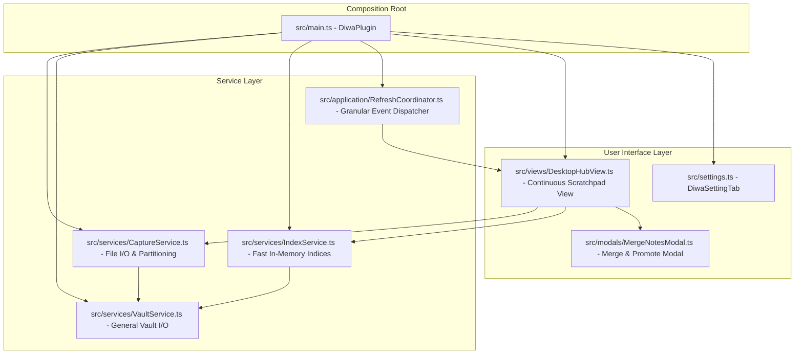

# System Patterns: DIWA — Personal OS Architecture

## 1. Tech Stack & Dependencies
*   **Compilation**: Compiled via `esbuild.config.mjs` from `src/main.ts` into a single file `main.js`, with style declarations in `styles.css`. Builds are deployed automatically to the active vault at `/Users/K26/Obsidian/K0000/.obsidian/plugins/Obsidian_diwa`.
*   **TypeScript**: Targeted at `ESNext` modules with strict type checks.
*   **Dependencies**: Obsidian API, `chrono-node` for natural-language dates.

---

## 2. Core Service Architecture

DIWA uses a decoupled, event-driven service architecture:

### Capture Service (`src/services/CaptureService.ts`)
*   Manages atomic note creation in `<captureFolder>/YYYY/MM/YYYY-MM-DD HH.mm.ss.md` (default: `000 Bin/Diwa/`).
*   Generates clean YAML frontmatter (`created`, `modified`, `area`, `tags`, `hasTasks`).
*   Provides in-place task toggling (`toggleTaskInFile`), updating markdown `- [ ]` $\leftrightarrow$ `- [x]` without UI reload.
*   Provides atomic note content and taxonomy updates (`updateNoteContent`).
*   Draft persistence in `localStorage` for zero-data-loss user input.
*   Multi-note merging (`mergeNotes`).

### Index Service (`src/services/IndexService.ts`)
*   Synchronous in-memory cache: `captureIndex: Map<string, CaptureEntry>`.
*   Parses frontmatter, body, markdown tasks, and tags.
*   Provides instant queries: `getAllCaptures()`, `getOpenTaskCount()`, `getUntaggedCount()`, `getAreaCounts()`.

### Refresh Coordinator (`src/application/RefreshCoordinator.ts`)
*   Listens to Obsidian workspace and vault events with debouncing and cooldown mechanisms to avoid duplicate re-renders.
*   Dispatches granular refresh events (`all`, `tasks`, `thoughts`, `capture`) to open views.

---

## 3. Continuous Scratchpad View (`DesktopHubView`)

The **Continuous Scratchpad** is the primary interactive hub:
1.  **Header Bar**: Logo, fast debounced search input, `[ Select ]` multi-note merge toggle, `[ 🧹 N Untagged ]` Inbox Sweeper button, Settings button.
2.  **Filter Carousel**: `[ All Notes ]`, `[ ☑️ Open Tasks ]`, Life Area chips (`[ 💼 Work ]`, `[ 🌱 Health ]`, `[ 💰 Wealth ]`, `[ 💡 Growth ]`).
3.  **Adaptive Composer**:
    *   *Desktop & Tablet*: Top Hero composer with borderless input capsule, `[ ☑️ Task ]` shortcut, life area selector chips, and `⌘ Enter` save shortcut.
    *   *Mobile*: Compact 2-row frosted-glass floating bar (`backdrop-filter: blur(20px)`) with zero inner outline noise: Row 1 task shortcut + input + circular send button; Row 2 swipeable life-area pills.
4.  **Continuous Document Stream**:
    *   Clean typography without card boxes, borders, or inner outlines.
    *   Hairline date separator dividers ("Today", "Yesterday", etc.).
    *   Interactive life area badges with 1-tap dropdown menu for direct category reassignment.
    *   Rendered markdown body with embeds and inline interactive `- [ ]` checkboxes with strike-through feedback.
    *   Action menu: Edit in-place (`✏️`), Delete (`🗑️`), and dedicated `Select` mode for multi-note merge.
5.  **Performance Optimization**: Progressive 25-item lazy loading via `IntersectionObserver` with in-memory Markdown DOM cache.

---

## 4. Mobile Viewport & Search Architecture
*   **Visual Viewport Listener**: `attachMobileSheetViewportBehavior` dynamically tracks `window.visualViewport` to compute `--diwa-visible-h` (visual viewport bottom − DIWA root top), compute `--diwa-kb-h` as the uncompensated keyboard overlap (parent bottom − visual viewport bottom; 0 when Obsidian already resized its container), and toggle `.has-mobile-keyboard` on `DesktopHubView.contentEl`.
*   **Keyboard Offset Containment**: `.diwa-workspace-root.has-mobile-keyboard` constrains height to `var(--diwa-visible-h, calc(100% - var(--diwa-kb-h, 0px)))` so content uses the actual visible viewport instead of unreliable iOS layout-viewport percentages.
*   **Search Stream Precedence**: Keyword search in `getFilteredCaptures()` takes global precedence across all notes, bypassing category/life-area filters. Opening mobile search auto-resets filter to `'all'` and triggers immediate re-render.
*   **Progressive Dynamic Height**: Uses `@supports (height: 100dvh)` fallback for dynamic viewport scaling on modern iOS.

---

## 5. Wikilink Interaction Architecture (`WikilinkPeekModal` & Protected Leaves)
*   **Link Routing & Segregation**: `DesktopHubView.attachInteractiveElements` intercepts all `a.internal-link` anchors in rendered stream captures:
    *   *Date Links* (`YYYY-MM-DD`): Intercepted by `openDateActionMenu` for snooze/tickler scheduling.
    *   *Note Wikilinks*: Handled through responsive platform routing without evicting the DIWA workspace leaf.
*   **Mobile Slide-Up Bottom Sheet (`WikilinkPeekModal`)**:
    *   Styled with `.pos-mobile-bottom-sheet` and `.pos-bottom-sheet-backdrop` (`backdrop-filter: blur(8px)`).
    *   Occupies 68vh (expanding up to 88vh) with touch drag-handle and swipe-down-to-dismiss gesture threshold (>80px delta).
    *   Renders note markdown live via `MarkdownRenderer` with explicit `Component` lifecycle (`load()`/`unload()`).
    *   Interactive task checkboxes inside the sheet update the target note atomically via `app.vault.process()`.
    *   Built-in **Quick Append Bar**: Allows appending thoughts or `- [ ]` tasks directly to the referenced note via atomic write without opening the note editor.
    *   Unresolved (Ghost) link handling: Displays clean empty state with a 1-tap `[ ➕ Create Note ]` action.
*   **Desktop Protected Split Navigation**:
    *   Normal left-click searches for an adjacent open markdown leaf (`workspace.getLeavesOfType('markdown')`) or opens a vertical split leaf (`workspace.getLeaf('split', 'vertical')`). The DIWA leaf is never replaced or evicted.
    *   Modifier clicks: `Cmd/Ctrl + Click` opens in a new background tab (`'tab'`), `Alt + Click` opens in a floating window (`'window'`).
    *   Hover Preview: Fires `workspace.trigger('hover-link', ...)` so Obsidian core's **Page Preview** works natively.
    *   Context Menu (`openWikilinkActionMenu`): Right-click (or long press on mobile) provides instant options: *Quick Preview*, *Filter Stream for [[...]]*, *Open in Adjacent Split*, *Open in New Tab*, and *Copy Wikilink*.
*   **Stream Pivot Query (`filterStreamByWikilink`)**:
    *   Instantly targets DIWA search input to `[[Note]]` or note title, recalibrating the continuous stream and filter counters to display all related inbox captures.

